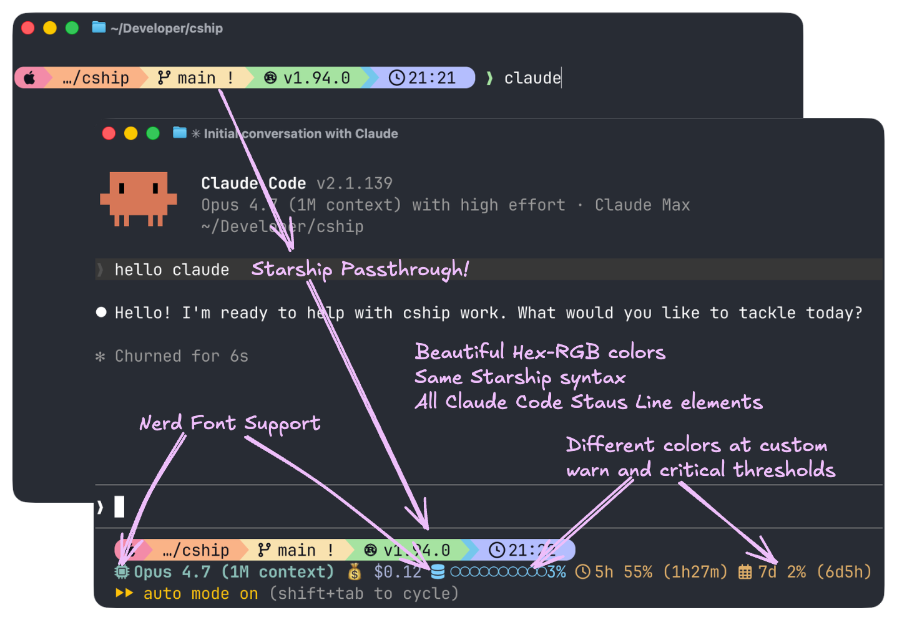
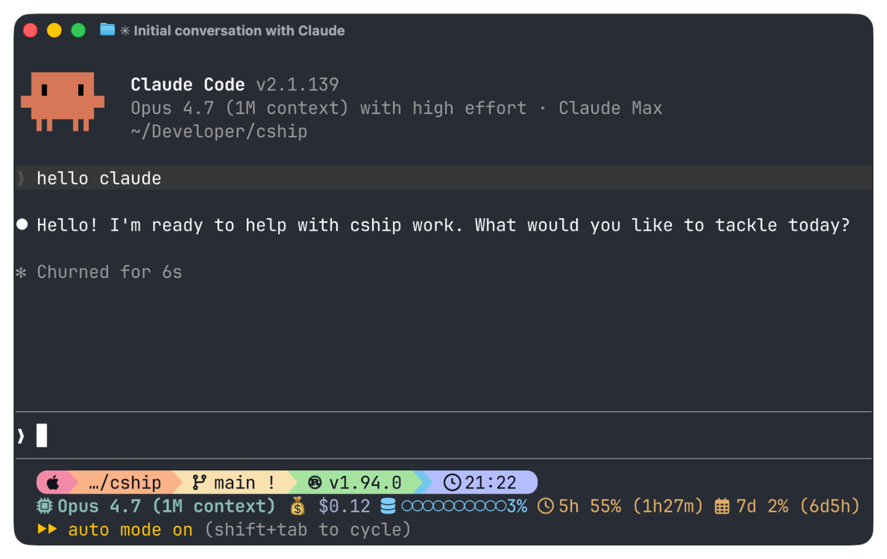
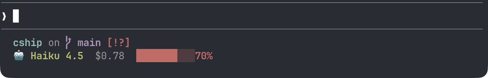
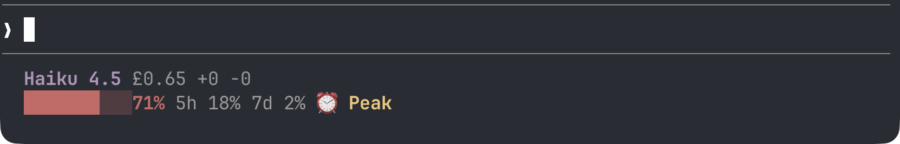
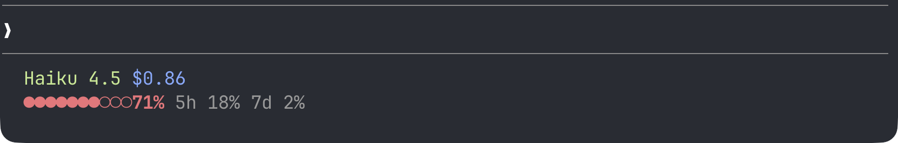
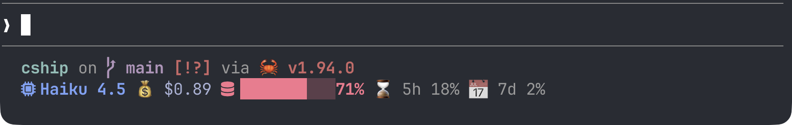

<div align="center">

# ⚓ CShip (pronounced "sea ship")

[](https://github.com/stephenleo/cship/actions/workflows/ci.yml)
[](https://crates.io/crates/cship)
[](https://crates.io/crates/cship)
[](https://github.com/stephenleo/cship/releases/latest)
[](https://github.com/stephenleo/cship/releases)
[](https://github.com/stephenleo/cship/blob/main/LICENSE)

**A beautiful, fully customizable statusline for Claude Code**<br>
*Starship-style TOML config, themeable colours, Nerd Font glyphs, and tunable cost/context/usage thresholds.*



</div>

`cship` renders a live statusline for [Claude Code](https://claude.ai/code) sessions, showing session cost, context window usage, model name, API usage limits, and more — all configurable via a simple TOML file.

### Key features:
- 🎨 Fully Customizable: Configure every module with Starship-compatible TOML. Colors, symbols, thresholds — your statusline, your rules.
- ⚡ Blazing Fast: Written in Rust with a ≤10ms render budget.
- 🔌 Starship Passthrough: Embed any [Starship](https://starship.rs) module (git_branch, directory, language runtimes) right next to native CShip modules.
- 💰 Session Insights: Track cost, context window usage, API limits, vim mode, agent name, and more — all from Claude Code's live JSON feed. Implement custom warn and critical thresholds with custom colors for each. 

## 🚀 Install

### ⚡ Method 1a: curl installer (macOS / Linux)

```sh
curl -fsSL https://cship.dev/install.sh | bash
```

Auto-detects your OS and architecture (macOS arm64/x86_64, Linux x86_64/aarch64), downloads the binary to `~/.local/bin/cship`, creates a starter config at `~/.config/cship.toml`, and wires the `statusLine` entry in `~/.claude/settings.json`.

Optional dependencies ([Starship](https://starship.rs) for passthrough modules, and `libsecret-tools` on Linux for usage limits) are handled as follows:

- **Interactive terminal** — the installer prompts you for each.
- **`--yes` / `-y`** — auto-installs all optional deps without prompting:
  ```sh
  curl -fsSL https://cship.dev/install.sh | bash -s -- --yes
  ```
- **Non-interactive** (Docker `RUN`, CI pipelines, no TTY) — optional deps are skipped automatically; the installer prints instructions for manual installation.

### 🪟 Method 1b: PowerShell installer (Windows)

Run this one-liner in PowerShell (5.1 or later):

```powershell
irm https://cship.dev/install.ps1 | iex
```

Installs to `%USERPROFILE%\.local\bin\cship.exe`, writes config to `%USERPROFILE%\.config\cship.toml`, and registers the statusline in `%USERPROFILE%\.claude\settings.json`.

> You can inspect the script before running: [install.ps1](https://cship.dev/install.ps1)

### 📦 Method 2: cargo install

Requires the Rust toolchain.

```sh
cargo install cship
```

After installing with `cargo` on **macOS / Linux**, wire the statusline manually in `~/.claude/settings.json`:

```json
{
  "statusLine": { "type": "command", "command": "cship" }
}
```

After installing with `cargo` on **Windows**, wire the statusline manually in `%APPDATA%\\Claude\\settings.json`:

```json
{
  "statusLine": { "type": "command", "command": "cship" }
}
```

## ⚙️ Configuration

- The default config file is `~/.config/cship.toml` (on Windows: `%USERPROFILE%\.config\cship.toml`).
- You can also place a `cship.toml` in your project root for per-project overrides. 
- The `lines` array defines the rows of your statusline. 
- Each element is a format string mixing `$cship.<module>` tokens (native cship modules) with Starship module tokens (e.g. `$git_branch`).
- See the [Showcase](#-showcase) below for ready-to-use configs you can drop straight into `~/.config/cship.toml`.

### 🧩 Available modules

Everything in the [Claude Code status line documentation](https://code.claude.com/docs/en/statusline#available-data) is available as a `$cship.<module>` token for you to mix and match in the `lines` format strings. Here are the most popular ones:

| Token | Description |
|-------|-------------|
| `$starship_prompt` | Full rendered Starship prompt (all configured modules in one row) |
| `$cship.model` | Claude model name |
| `$cship.cost` | Session cost (configurable currency; default `$X.XX`) |
| `$cship.context_bar` | Visual progress bar of context window usage |
| `$cship.context_window` | Context window tokens (used/total) |
| `$cship.context_window.used_tokens` | Real token count in context with percentage (e.g. `8%(79k/1000k)`) |
| `$cship.cost.total_lines_added` | Lines added this session |
| `$cship.cost.total_lines_removed` | Lines removed this session |
| `$cship.impact` | Deterministic 0–100 session impact score (shipped work + token efficiency + breadth). [Details ↓](#-impact-score-cshipimpact) |
| `$cship.usage_limits` | API usage limits (5hr / 7-day, plus per-model and extra-usage when available) |
| `$cship.usage_limits.per_model` | 7-day per-model breakdown (opus / sonnet / cowork / oauth) |
| `$cship.usage_limits.extra_usage` | Extra-credits section with `{active}` indicator |
| `$cship.account` | Authenticated Anthropic account (work/personal); map org names via `labels` |
| `$cship.peak_usage` | Peak-time indicator (US Pacific business hours) |
| `$cship.agent` | Sub-agent name |
| `$cship.effort` | Reasoning effort level (`low`/`medium`/`high`/`xhigh`/`max`) |
| `$cship.session` | Session identity info |
| `$cship.workspace` | Workspace/project directory |

Full configuration reference: **https://cship.dev**

### ⚡ Impact score (`$cship.impact`)

A deterministic **0–100 score** for how much a coding session is actually
accomplishing — updated live each turn, right next to your cost and context bar.
Unlike an LLM-guessed "vibe" number, every point is reproducible from concrete
signals:

| Signal | Source | Weight (default) |
|--------|--------|------------------|
| Commits shipped this session | local `git` | `commit_weight` (4) |
| Merges landed this session | local `git` | `merge_weight` (8) |
| Token efficiency — code churn per `$` | statusline `total_lines_*` + `total_cost_usd` | `efficiency_weight` (1) |
| Breadth — files changed vs `HEAD` | local `git` (`git diff HEAD`) | `breadth_weight` (1) |
| Anti-thrash — cost burned with nothing to show | `total_cost_usd` | `thrash_penalty` (−3) |

```
raw   = 4·commits + 8·merges + 1·(churn/$ ÷ 200) + 1·files − 3·thrash
score = round(100 · raw / (raw + K))          # K = saturation_k (10)
```

The score **saturates** (via `K`) so it stays in 0–100 and rewards early wins
more than the 50th commit. **Commits and merges** are diffed against a
**per-session baseline** captured on the session's first render, so shipped-work
reflects *this* session, not the repo's whole history; **breadth** is the current
uncommitted working tree (`git diff HEAD`). Git runs at most once per
`cache_ttl_secs` (default 5s) behind a cache — the token terms refresh every
render, so the score reacts live without a `git` call per keystroke. The trailing
`▲/▼` delta (when `show_delta` is on) compares against the **previous render's**
score, so it appears on the render where the number actually changes. Outside a
git repo the score degrades gracefully to the token-efficiency signal alone.

> `K` and the thresholds ship calibrated against 2404 real git sessions
> (`scripts/calibrate_impact.py`): the median session scores ~60, the top decile
> ~86. Re-run that script if you retune the weights.

**Threshold colouring is inverted vs `cost`** — for impact, *higher is better*,
so `warn_threshold` / `critical_threshold` are treated as *floors*: the score
escalates to `warn_style` at/below `warn_threshold` and to `critical_style`
at/below `critical_threshold`.

```toml
[cship]
lines = ["$cship.model $cship.cost $cship.impact"]

[cship.impact]
symbol             = "⚡ "
style              = "bold green"
warn_threshold     = 50          # score ≤ 50 → warn colour
warn_style         = "yellow"
critical_threshold = 20          # score ≤ 20 → critical colour
critical_style     = "bold red"
show_delta         = true        # trailing ▲/▼ vs the previous render

# ── optional score tuning (defaults shown) ──
# commit_weight = 4.0
# merge_weight = 8.0
# efficiency_weight = 1.0
# breadth_weight = 1.0
# thrash_penalty = 3.0
# churn_per_dollar_scale = 200.0
# saturation_k = 10.0
# thrash_cost_threshold = 0.10
# cache_ttl_secs = 5
```

Renders like: `⚡ 62 ▲+4`.

## 🔍 Debugging

Run `cship explain` to inspect what cship sees from Claude Code's context JSON — useful when a module shows nothing or behaves unexpectedly.

```sh
cship explain
```

To check the installed binary version:

```sh
cship --version   # or: cship -v
```

## ✨ Showcase

Ready-to-use configurations — from the recommended full-featured setup down to a minimal single-line bar. Each can be dropped into `~/.config/cship.toml`.

---

### 1. ⚓ Hero / Recommended

My personal setup, end to end. Top row: `$starship_prompt` running Starship's [Catppuccin Powerline preset](https://starship.rs/presets/catppuccin-powerline). Bottom row: model, effort, cost, impact score, context bar — thresholds escalate cool → warn → critical as budgets fill. (Add `$cship.usage_limits` / `$cship.peak_usage` back to the `lines` row if you want API-budget tracking — see the showcases below.)



<details>
<summary>View config</summary>

**`~/.config/cship.toml`**

```toml
[cship]
lines = [
  "$starship_prompt",
  "$cship.model $cship.effort $cship.cost $cship.impact $cship.context_bar",
]

[cship.model]
symbol = " "
style  = "bold cyan"

[cship.effort]
symbol      = "⚡ "
style       = "fg:#7dcfff"
high_style  = "fg:#e0af68"
xhigh_style = "bold fg:#e0af68"
max_style   = "bold fg:#f7768e"

[cship.context_bar]
symbol             = " "
filled_char        = "●"
empty_char         = "○"
format             = "[$symbol$value]($style)"
width              = 10
style              = "fg:#7dcfff"
warn_threshold     = 40.0
warn_style         = "fg:#e0af68"
critical_threshold = 70.0
critical_style     = "bold fg:#f7768e"

[cship.cost]
symbol             = "💰 "
style              = "fg:#a9b1d6"
warn_threshold     = 10
warn_style         = "fg:#e0af68"
critical_threshold = 50
critical_style     = "bold fg:#f7768e"

[cship.impact]
symbol             = "🎯 "
style              = "bold fg:#9ece6a"
warn_threshold     = 50          # score ≤ 50 → warn colour (floor semantics)
warn_style         = "fg:#e0af68"
critical_threshold = 20          # score ≤ 20 → critical colour
critical_style     = "bold fg:#f7768e"
show_delta         = true        # trailing ▲/▼ vs the previous render
```

**`~/.config/starship.toml`** — Starship's [Catppuccin Powerline preset](https://starship.rs/presets/catppuccin-powerline):

```toml
"$schema" = 'https://starship.rs/config-schema.json'

format = """
[](red)\
$os\
$username\
[](bg:peach fg:red)\
$directory\
[](bg:yellow fg:peach)\
$git_branch\
$git_status\
[](fg:yellow bg:green)\
$c\
$rust\
$golang\
$nodejs\
$php\
$java\
$kotlin\
$haskell\
$python\
[](fg:green bg:sapphire)\
$conda\
[](fg:sapphire bg:lavender)\
$time\
[ ](fg:lavender)\
$cmd_duration\
$line_break\
$character"""

palette = 'catppuccin_mocha'

[os]
disabled = false
style = "bg:red fg:crust"
format = "[$symbol ]($style)"

[os.symbols]
Macos = "󰀵"
# (full OS symbol list trimmed for brevity — see the preset link above)

[username]
show_always = false
style_user = "bg:red fg:crust"
style_root = "bg:red fg:crust"
format = '[ $user]($style)'

[directory]
style = "bg:peach fg:crust"
format = "[ $path ]($style)"
truncation_length = 3
truncation_symbol = "…/"

[directory.substitutions]
"Documents" = "󰈙 "
"Downloads" = " "
"Music" = "󰝚 "
"Pictures" = " "
"Developer" = "󰲋 "

[git_branch]
symbol = ""
style = "bg:yellow"
format = '[[ $symbol $branch ](fg:crust bg:yellow)]($style)'

[git_status]
style = "bg:yellow"
format = '[[($all_status$ahead_behind )](fg:crust bg:yellow)]($style)'

[nodejs]
symbol = ""
style = "bg:green"
format = '[[ $symbol( $version) ](fg:crust bg:green)]($style)'

[rust]
symbol = ""
style = "bg:green"
format = '[[ $symbol( $version) ](fg:crust bg:green)]($style)'

[golang]
symbol = ""
style = "bg:green"
format = '[[ $symbol( $version) ](fg:crust bg:green)]($style)'

[python]
symbol = ""
style = "bg:green"
format = '[[ $symbol( $version)(\(#$virtualenv\)) ](fg:crust bg:green)]($style)'

[conda]
symbol = "  "
style = "fg:crust bg:sapphire"
format = '[$symbol$environment ]($style)'
ignore_base = false

[time]
disabled = false
time_format = "%R"
style = "bg:lavender"
format = '[[  $time ](fg:crust bg:lavender)]($style)'

[line_break]
disabled = true

[character]
success_symbol = '[❯](bold fg:green)'
error_symbol = '[❯](bold fg:red)'
vimcmd_symbol = '[❮](bold fg:green)'

[cmd_duration]
show_milliseconds = true
format = "⏳ $duration "
style = "bg:lavender"
show_notifications = true
min_time_to_notify = 45000

# Catppuccin Mocha palette — full palette + frappe/latte/macchiato variants
# omitted for brevity. Grab them from the preset link above.
[palettes.catppuccin_mocha]
rosewater = "#f5e0dc"
flamingo  = "#f2cdcd"
pink      = "#f5c2e7"
mauve     = "#cba6f7"
red       = "#f38ba8"
maroon    = "#eba0ac"
peach     = "#fab387"
yellow    = "#f9e2af"
green     = "#a6e3a1"
teal      = "#94e2d5"
sky       = "#89dceb"
sapphire  = "#74c7ec"
blue      = "#89b4fa"
lavender  = "#b4befe"
text      = "#cdd6f4"
crust     = "#11111b"
```

</details>

---

### 2. 🪶 Minimal

One clean row. Model, cost with colour thresholds, context bar.


<details>
<summary>View config</summary>

```toml
[cship]
lines = ["$cship.model  $cship.cost  $cship.context_bar"]

[cship.cost]
style              = "green"
warn_threshold     = 2.0
warn_style         = "yellow"
critical_threshold = 5.0
critical_style     = "bold red"

[cship.context_bar]
width              = 10
warn_threshold     = 40.0
warn_style         = "yellow"
critical_threshold = 70.0
critical_style     = "bold red"
```

</details>

---

### 3. 🌿 Git-Aware Developer

Two rows: Starship git status on top, Claude session below. Starship passthrough (`$directory`, `$git_branch`, `$git_status`) requires [Starship](https://starship.rs) to be installed. Each Claude family gets its own colour via `haiku_style` / `sonnet_style` / `opus_style` so you can tell which model you're talking to at a glance.



<details>
<summary>View config</summary>

```toml
[cship]
lines = [
  "$directory$git_branch$git_status",
  "$cship.model  $cship.cost  $cship.context_bar",
]

[cship.model]
symbol       = "🤖 "
haiku_style  = "bold green"
sonnet_style = "bold cyan"
opus_style   = "bold magenta"

[cship.cost]
warn_threshold     = 2.0
warn_style         = "yellow"
critical_threshold = 5.0
critical_style     = "bold red"

[cship.context_bar]
width              = 10
warn_threshold     = 40.0
warn_style         = "yellow"
critical_threshold = 70.0
critical_style     = "bold red"
```

</details>

---

### 4. 💰 Cost Guardian

Shows cost, lines changed, rolling API usage limits, and a peak-time indicator. Colour escalates as budgets fill. Displays the cost in GBP via `currency_symbol` + `conversion_rate` — thresholds are evaluated against the converted display value, so restate them in your display currency.



<details>
<summary>View config</summary>

```toml
[cship]
lines = [
  "$cship.model $cship.cost +$cship.cost.total_lines_added -$cship.cost.total_lines_removed",
  "$cship.context_bar $cship.usage_limits $cship.peak_usage",
]

[cship.model]
style = "bold purple"

[cship.cost]
currency_symbol    = "£"
conversion_rate    = 0.79
warn_threshold     = 0.8     # thresholds are in the display currency (GBP)
warn_style         = "bold yellow"
critical_threshold = 2.4
critical_style     = "bold red"

[cship.context_bar]
width              = 10
warn_threshold     = 40.0
warn_style         = "yellow"
critical_threshold = 70.0
critical_style     = "bold red"

[cship.usage_limits]
ttl                = 60        # cache TTL in seconds; increase if running many concurrent sessions
five_hour_format   = "5h {pct}%"
seven_day_format   = "7d {pct}%"
separator          = " "
warn_threshold     = 70.0
warn_style         = "bold yellow"
critical_threshold = 90.0
critical_style     = "bold red"

[cship.peak_usage]
style = "bold yellow"
```

</details>

---

### 5. 🎨 Material Hex

Every style value is a `fg:#rrggbb` hex colour — no named colours anywhere. Amber warns, coral criticals. Uses `filled_char` / `empty_char` to swap the default blocky bar for dotted glyphs (`●` / `○`).



<details>
<summary>View config</summary>

```toml
[cship]
lines = [
  "$cship.model $cship.cost",
  "$cship.context_bar $cship.usage_limits",
]

[cship.model]
style = "fg:#c3e88d"

[cship.cost]
style              = "fg:#82aaff"
warn_threshold     = 2.0
warn_style         = "fg:#ffcb6b"
critical_threshold = 6.0
critical_style     = "bold fg:#f07178"

[cship.context_bar]
width              = 10
filled_char        = "●"
empty_char         = "○"
style              = "fg:#89ddff"
warn_threshold     = 40.0
warn_style         = "fg:#ffcb6b"
critical_threshold = 70.0
critical_style     = "bold fg:#f07178"

[cship.usage_limits]
five_hour_format   = "5h {pct}%"
seven_day_format   = "7d {pct}%"
separator          = " "
warn_threshold     = 70.0
warn_style         = "fg:#ffcb6b"
critical_threshold = 90.0
critical_style     = "bold fg:#f07178"
```

</details>

---

### 6. 🌃 Tokyo Night

Three-row layout for polyglot developers. Starship handles language runtimes and git; cship handles session data. Styled with the [Tokyo Night](https://github.com/folke/tokyonight.nvim) colour palette.


<details>
<summary>View config</summary>

```toml
[cship]
lines = [
  """
  $directory\
  $git_branch\
  $git_status\
  $python\
  $nodejs\
  $rust
  """,
  "$cship.model $cship.agent",
  "$cship.context_bar $cship.cost $cship.usage_limits",
]

[cship.model]
symbol = "🤖 "
style  = "bold fg:#7aa2f7"

[cship.agent]
symbol = "↳ "
style  = "fg:#9ece6a"

[cship.context_bar]
width              = 10
style              = "fg:#7dcfff"
warn_threshold     = 40.0
warn_style         = "fg:#e0af68"
critical_threshold = 70.0
critical_style     = "bold fg:#f7768e"

[cship.cost]
symbol             = "💰 "
style              = "fg:#a9b1d6"
warn_threshold     = 2.0
warn_style         = "fg:#e0af68"
critical_threshold = 5.0
critical_style     = "bold fg:#f7768e"

[cship.usage_limits]
five_hour_format   = "⌛ 5h {pct}%"
seven_day_format   = "📅 7d {pct}%"
separator          = " "
warn_threshold     = 70.0
warn_style         = "fg:#e0af68"
critical_threshold = 90.0
critical_style     = "bold fg:#f7768e"
```

</details>

---

### 7. 🔤 Nerd Fonts

Requires a [Nerd Font](https://www.nerdfonts.com) in your terminal. Icons are embedded as `symbol` values on each module and as literal characters in the format string for Starship passthrough rows. You can use `format` to control how the symbol and value are combined for each module exactly like you'd do with Starship. Enables `show_per_model = true` to append the 7-day per-model breakdown to `$cship.usage_limits`, with a custom `sonnet_format` row.



<details>
<summary>View config</summary>

```toml
[cship]
lines = [
  """
  $directory\
  $git_branch\
  $git_status\
  $python\
  $nodejs\
  $rust
  """,
  "$cship.model $cship.cost $cship.context_bar $cship.usage_limits",
]

[cship.model]
symbol = " "
style  = "bold fg:#7aa2f7"

[cship.cost]
symbol             = "💰 "
style              = "fg:#a9b1d6"
warn_threshold     = 2.0
warn_style         = "fg:#e0af68"
critical_threshold = 5.0
critical_style     = "bold fg:#f7768e"

[cship.context_bar]
symbol             = " "
format             = "[$symbol$value]($style)"
width              = 10
style              = "fg:#7dcfff"
warn_threshold     = 40.0
warn_style         = "fg:#e0af68"
critical_threshold = 70.0
critical_style     = "bold fg:#f7768e"

[cship.usage_limits]
five_hour_format   = "⌛ 5h {pct}%"
seven_day_format   = "📅 7d {pct}%"
sonnet_format      = "🎼 {pct}%"
separator          = " "
show_per_model     = true
warn_threshold     = 70.0
warn_style         = "fg:#e0af68"
critical_threshold = 90.0
critical_style     = "bold fg:#f7768e"
```

</details>

---

## 📚 Full documentation

→ **[cship.dev](https://cship.dev)**

Complete configuration reference, format string syntax, all module options, and examples.

---

If you found this project useful, please give us a star ⭐ on [GitHub](https://github.com/stephenleo/cship)!

If you find bugs or have suggestions, open an issue or submit a pull request. Contributions are very welcome!

Before submitting a PR, run the following to match what CI checks:

```sh
cargo fmt && cargo clippy -- -D warnings && cargo test && cargo build --release
```

See [CONTRIBUTING.md](CONTRIBUTING.md) for full details.

## 💡 Inspiration
- Inspired by [starship](https://starship.rs), built with Rust and the [Claude Code status line API](https://code.claude.com/docs/en/statusline).

## 📄 License

Apache-2.0
